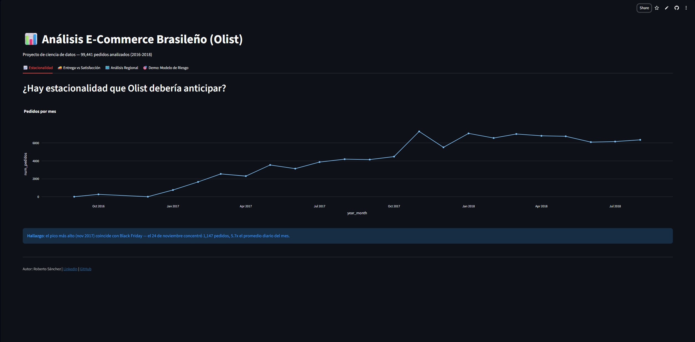
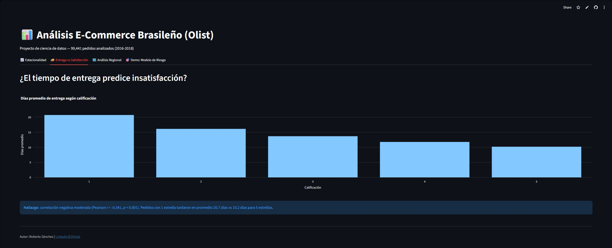
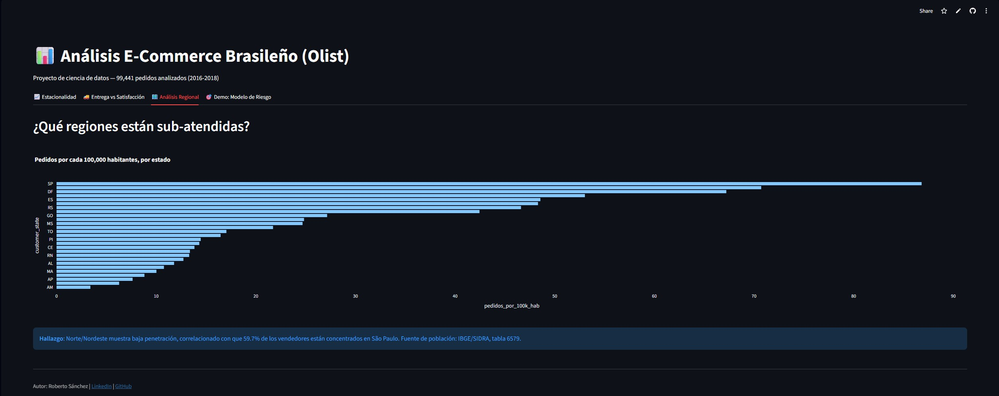
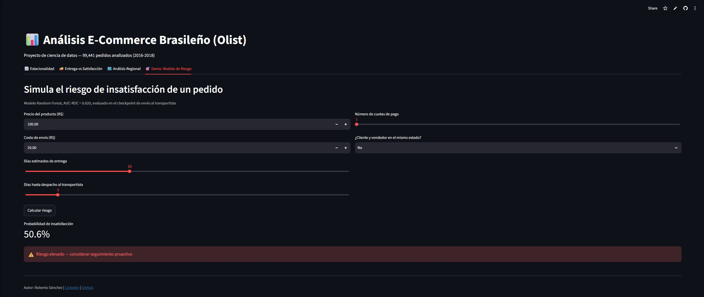

# Análisis E-Commerce Brasileño (Olist) — Proyecto de Ciencia de Datos

Análisis end-to-end de 99,441 pedidos del marketplace brasileño Olist (2016-2018), 
con enfoque en estacionalidad, satisfacción del cliente y penetración regional de mercado.

## Hallazgos principales

1. **Estacionalidad de Black Friday**: el 24 de noviembre de 2017 concentró 
   1,147 pedidos (5.7x el promedio diario del mes), evidenciando la necesidad 
   de planificación de inventario para fechas comerciales clave.

2. **Tiempo de entrega y satisfacción**: correlación moderada (Pearson r = -0.341, 
   p < 0.001, n = 95,795) entre días de entrega y calificación. Pedidos con 
   1 estrella tardaron en promedio 20.7 días vs 10.2 días para 5 estrellas.

3. **Brecha regional explicada por oferta, no solo demanda**: estados del 
   Norte/Nordeste muestran la menor penetración de mercado (pedidos por 100k 
   habitantes), correlacionado con que el 59.7% de los vendedores están 
   concentrados en São Paulo. Fuente de población: IBGE/SIDRA, tabla 6579.

## 🚀 Demo en vivo

Dashboard interactivo desplegado: **[Ver dashboard](https://ecommerce-analytics-portfolio-bvghquvjepnpsvq9tdm9hn.streamlit.app)**

## Hallazgos principales

1. **Estacionalidad de Black Friday**: el 24 de noviembre de 2017 concentró 
   1,147 pedidos (5.7x el promedio diario del mes), evidenciando la necesidad 
   de planificación de inventario para fechas comerciales clave.

2. **Tiempo de entrega y satisfacción**: correlación moderada (Pearson r = -0.341, 
   p < 0.001, n = 95,795) entre días de entrega y calificación. Pedidos con 
   1 estrella tardaron en promedio 20.7 días vs 10.2 días para 5 estrellas.

3. **Brecha regional explicada por oferta, no solo demanda**: estados del 
   Norte/Nordeste muestran la menor penetración de mercado (pedidos por 100k 
   habitantes), correlacionado con que el 59.7% de los vendedores están 
   concentrados en São Paulo. Fuente de población: IBGE/SIDRA, tabla 6579.

4. **Modelo de riesgo de insatisfacción**: Random Forest con AUC-ROC de 0.620, 
   evaluado en el checkpoint de envío al transportista. Ver sección de 
   modelado para detalles de iteración y limitaciones.

## Stack técnico

Python, pandas, matplotlib/seaborn, scipy (pruebas estadísticas), Jupyter.

## Estructura del repo

- `/data` — Dataset Olist (Kaggle) [no incluido en git, ver instrucciones abajo]
- `/notebooks` — Análisis exploratorio y modelado
- `/src` — Scripts reutilizables
- `/reports` — Reportes exportados

## Fuentes de datos

- Ventas: [Brazilian E-Commerce Public Dataset by Olist](https://www.kaggle.com/datasets/olistbr/brazilian-ecommerce)
- Población por estado: [IBGE - Estimativas da População, Tabela 6579](https://sidra.ibge.gov.br/tabela/6579)

## Cómo replicar

\`\`\`bash
python -m venv venv
source venv/Scripts/activate  # Windows Git Bash
pip install -r requirements.txt
\`\`\`

## Autor

**Roberto Sánchez**
[LinkedIn](https://www.linkedin.com/in/roberto-sánchez-ai-ml-developer) · [GitHub](https://github.com/Rob3rtoSanchez)